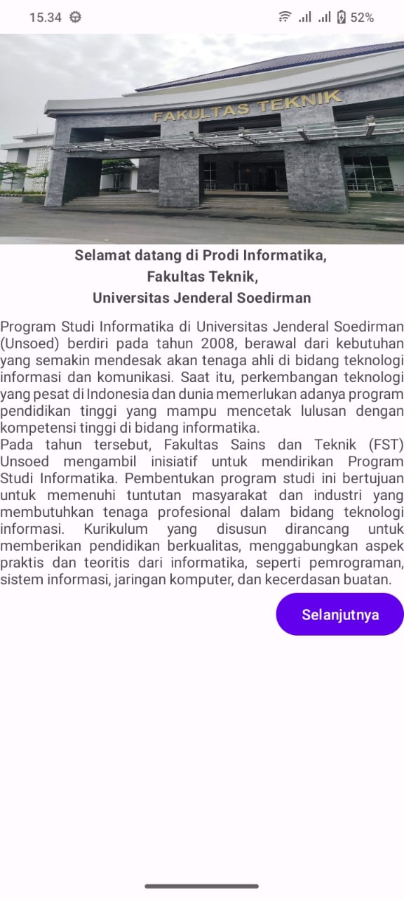
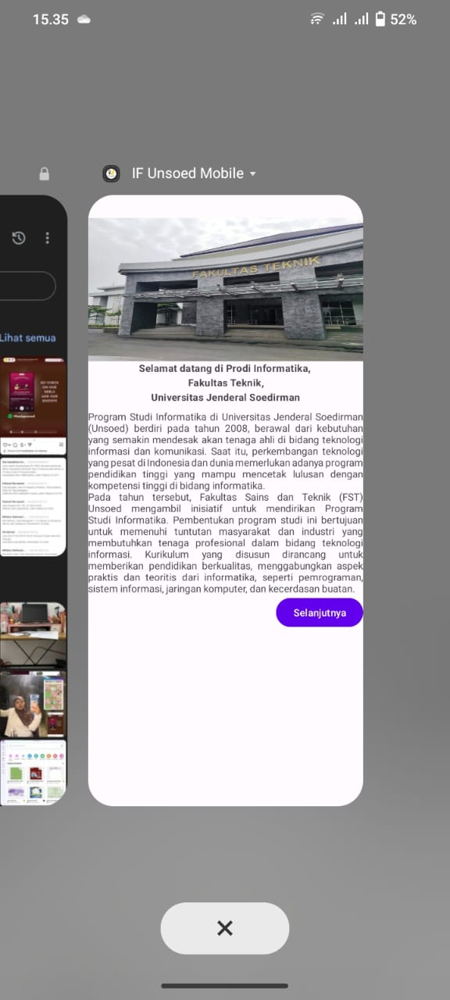
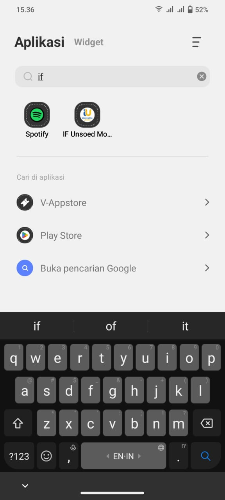

### Nama : Fatimah Nurmawati
### NIM : H1D023019
### Shift : C

---

# 📱 IF Unsoed Mobile

**IF Unsoed Mobile** adalah aplikasi Android sederhana yang menampilkan informasi seputar **Program Studi Informatika Universitas Jenderal Soedirman**.

---

## 🚀 Fitur & Tahapan 
1. **Inisialisasi Project** – Membuat project baru di Android Studio dengan struktur dasar aplikasi. 
2. **Pengaturan Resource** – Menambahkan strings.xml, colors.xml, ikon, dan aset pendukung lainnya. 
3. **Modifikasi Layout** – Mendesain tampilan utama (activity_main.xml) dengan ImageView, TextView, dan MaterialButton. 
4. **Menjalankan Aplikasi** – Meng-compile project dan menguji aplikasi langsung di perangkat Android melalui USB debugging.

---

## 📸 Tampilan Aplikasi
| Tampilan                     | History                        | APK Mobile                    |
|------------------------------|--------------------------------|-------------------------------|
|  |  |  |
